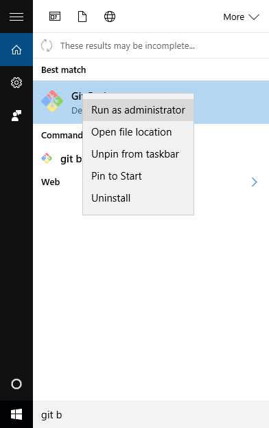
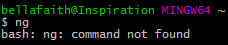

# Using _Angular CLI_ on Windows

To use _Angular CLI_ on Windows, it is recommended to `Run as Administrator` (for `Git Bash` or whatever CLI tool you are using). Othwerwise, your commands will take a bit and you'll be twiddling your thumbs or tapping your nails. This is especially true for the `ng build`, `ng serve` and `ng github-pages:deploy` commands. Here are some helpful tips for running your CLI as _admin_.

*Notes:*
- _Below I use `<` & `>` to surround values that you should replace for your username or something. When you replace these values with your own *do not include* the `<` and `>`._
- _From this point on, I'm going to assume the CLI tool you're using is *Git Bash*._

## How to Run as Admin

Right click on the _Git Bash_ icon & select the `Run as Administrator` option.

Not too hard, eh?

_Note: You may run into some issues. If you do, see tips below._

## After installing _Angular CLI_, I get `ng: command not found`

When attempting to run an `ng` command (say `ng -v` or `ng new ...`), do you see something like this?

`bash: ng: command not found`

### _Angular CLI may not have installed correctly. If so, it could be you need a more recent version of `Node` or `npm`._

- Download & install latest version of _Node_ (needs to be version 6 or higher)  
  https://nodejs.org/en/download/

- Update version of _npm_  
  In Git Bash, type `npm install npm@latest -g`

- Uninstall _Angular CLI_  
  In Git Bash, type `npm uninstall -g angular-cli`

- Clear _npm_ cache to be safe  
  In Git Bash, type `npm cache clean`

- Install _Angular CLI_  
  In Git Bash, type `npm install -g angular-cli@latest`

### If _Angular CLI_ did install correctly & you're getting `command not found`, follow these steps:

- Type this in _Git Bash_: `npm config get prefix`  
  You should get something that looks a bit like: `C:\Users\<yourUsername>\AppData\Roaming\npm`  
  _This will provide you the path to where your `npm` command ... TODO_

- Copy this into a text file & reformat it to look like this:  
  `/c/Users/<yourUsername>/AppData/Roaming/npm`

  *Tip*: `ctrl + v` doesn't work to paste into _Git Bash_. Instead use `shift + insert` or `shift + ins`.

- Add the newly reformatted path, to your `PATH` variable.  
  In _Git Bash_, type: `PATH=$PATH:<yourReformattedPathHere>`  
  [_should look similar to this_ `PATH=$PATH:/c/Users/bellafaith/AppData/Roaming/npm`]

- Try `ng version` in _Git Bash_ again ... did it work?

## Running as Admin? Path to your *trivia* folder may be a bit different

If you're running _Git Bash_ as admin & the account you're actively logged into on your computer is *not* the admin account, the path to access the directory [where your code lives] via _Git Bash_ may be slightly different. You may not see your `CodingAndCocktails` directory in your `/` or `~` folder. Try the following in _Git Bash_:

`cd /c/Users/<yourUsername>/CodingAndCocktails/trivia`
